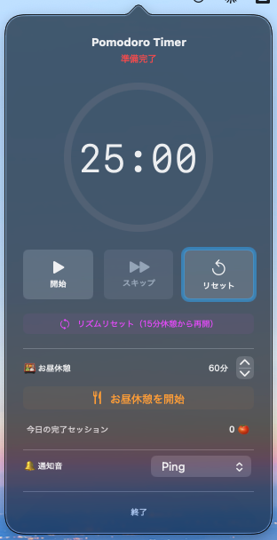
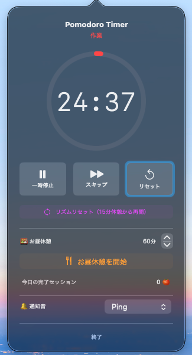

# Pomodoro Timer

macOSメニューバーに常駐するポモドーロタイマーアプリです。

<p align="center">
  
  
</p>

## 機能

- **ポモドーロサイクル** — 作業25分 → 短い休憩5分 → 4セット後に長い休憩15分
- **お昼休憩** — 10〜120分で調整可能
- **メニューバー表示** — 絵文字（🍅☕🎉🍱）と残り時間をリアルタイム表示
- **通知音** — 15種類のシステムサウンドから選択可能
- **作業ログ** — 完了セッション数・合計作業時間を自動記録

## 動作環境

- macOS 14 (Sonoma) 以降
- Swift 6.2

## ビルド

```bash
./build.sh
```

`build/PomodoroTimer.app` が生成されます。ダブルクリックで起動するか、`/Applications/` にコピーしてください。

## ライセンス

[MIT](LICENSE)
